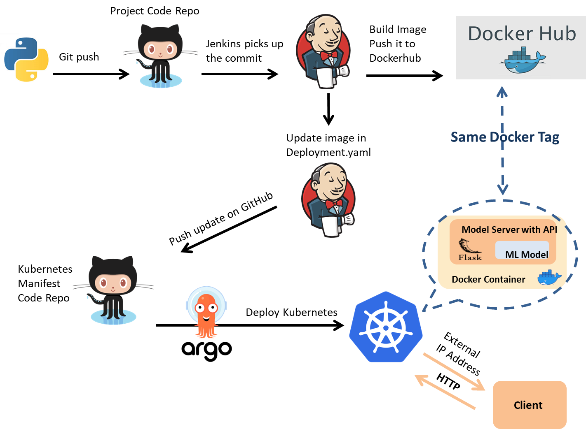

# Automation of Machine Learning with Jenkins, Kubernetes, Docker, ArgoCD and GitHub
The purpose of this project is to update my previous MLOps project for the Iris app <https://github.com/RozWhite/ML-automation-Flask-Docker-Jenkins-Kubernetes-Argo>, plus adding Kubernetes and Argo to the pipeline. This is an End to End automated CI/CD pipeline for ML application with Flask REST API, Flasgger, Jenkins, Kubernetes, Docker and Argo.</br></br>



## Project Structure
This project has the following steps:
1.	Building  Machine Learning Model with Logistic Regression
2.	Deploying Machine Learning Model with Flask API and Flasgger 
3.  Create a GitHub repository for the project code
4.	Create a GitHub repository for the Kubernetes manifest code
5.	Automating the two GitHub repos for Jenkins with Webhook
6.	Create a Jenkins job to build a Docker image from the project code repo and push it to Dockerhub
7.	Create a Jenkins job to update the Kubernetes manifest and modify the deployment file with the new image
8.	Create a new application in Argo to automatically deploy the new image to the Kubernetes cluster

#### To set up the Webhook, please visit the previous version of this project: 
 <https://github.com/RozWhite/ML-automation-Flask-Docker-Jenkins-Kubernetes-Argo>
## 	Jenkins job to build a Docker image
The first job the first Job will automatically pull repo from the GitHub Repo just by giving some triggers and then building a Docker image and push it to Dockerhub. In the Jenkins Dashboard, click the New Item, give it a name, and select Pipeline.</br>
</br>
</br>

##  Jenkins job to update the Kubernetes manifest
This job updates the Kubernetes manifest with new changes and pushes the new commit to the GitHub repository to modify the deployment file with the new image. In the Jenkins dashboard, click the new item, name it, and select Pipeline.</br></br> 
</br>
</br>

##  ArgoCD Start
After installing kubectl, minikube and ArgoCD, run in a cmd: 
```
minikube start

kubectl port-forward svc/argocd-server -n argocd 8080:443
```
This runs the Argo Server locally on your machine. To also start the UI on <http://localhost:8080>

NOTE: Minikube support LoadBalancer services via minikube tunnel. Open another cmd and run:
```
minikube tunnel

```

##  ArgoCD Setup
To run new application in Argo, click the NEW APP button in the Argo UI and fill in the remaining part as shown in the figures below and finally click CREATE.</br></br> 
</br></br>
</br></br>

#### Argo will deploy the application; below shows our app workflow:</br></br>
</br></br>

#### To get the External IP Address to Access an Application in a Cluster, open cmd in the Kubernetes manifest code folder and run:
```
kubectl get svc
```
</br>

#### Test the API at <http://127.0.0.1/apidocs/>

</br></br>
</br></br>

### New Commit:
Now this application is Zero Touch, try doing a commit in GitHub and see how each step is automatic. I will now change result 1 to result 2 from the image above and commit the new changes to the code repository waiting for the new app to be deployed and update the application link:</br></br> 
</br></br>